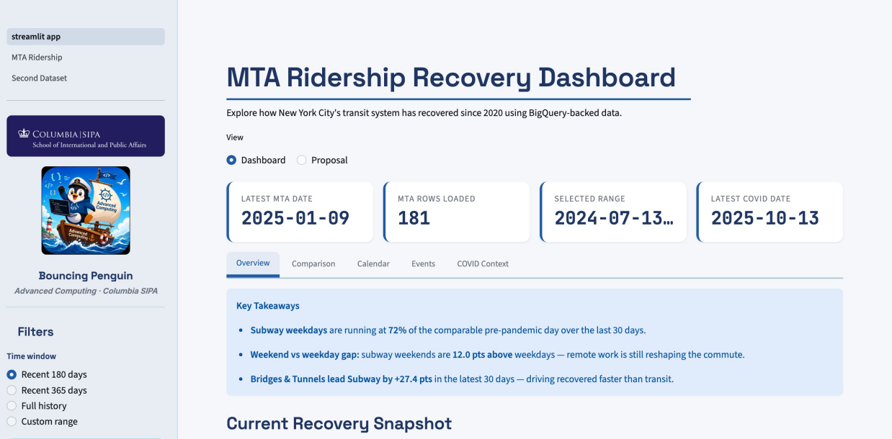
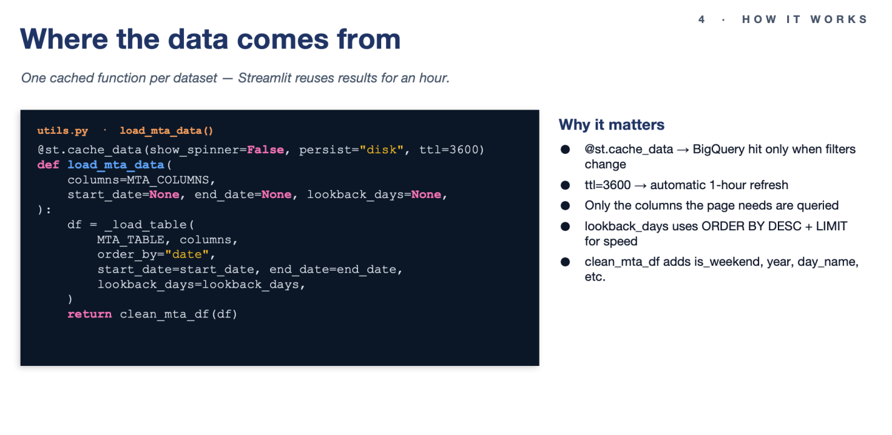
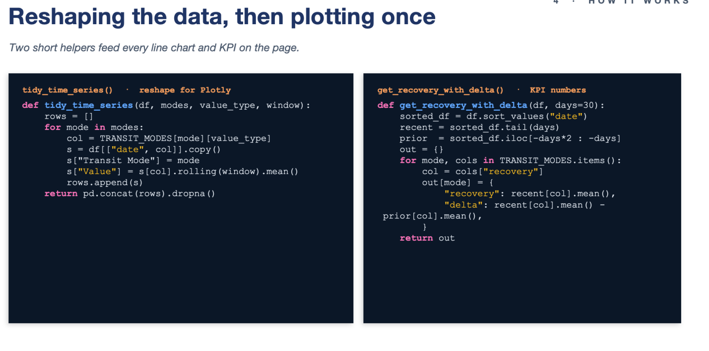

# Project 4: MTA Ridership Dashboard

**Haixin Lin**
Team: Bouncing Penguin (with Hanghai Li)

---

## What we built and why

This project — the MTA Ridership Dashboard — was the final deliverable for Advanced Computing for Policy. Hanghai and I built a Streamlit app on top of two BigQuery-backed NYC Open Data sources (mta_data.daily_ridership from data.ny.gov and mta_data.nyc_covid_cases from data.cityofnewyork.us) to answer three questions from our proposal: how have subway, bus, LIRR, and Metro-North recovered relative to comparable pre-pandemic days; how different are weekday and weekend recovery patterns, and has that gap changed over time; and do holidays, major events, and policy changes line up with visible ridership shifts. We chose batch loading for both sources because the tables are small, update on a daily cadence, and are easier to keep consistent with a full daily refresh than with event-by-event ingestion. Methodologically, the dashboard is built around three lenses on the same recovery metric — rolling averages to smooth weekly noise, weekday-versus-weekend splits, and event windows around holidays and policy changes — which let us compare absolute ridership and recovery percentages without ever pulling raw files into Streamlit.

---

## How the app is organized

From the proposal's three research questions, the app grew into five tabs that share the same sidebar filters (time window, transit-mode multi-select, rolling-average slider). Overview answers RQ1 directly — an auto-generated Key Takeaways box, four KPI cards comparing the latest 30 days against the prior 30, and four charts covering recovery, raw ridership, weekday-vs-weekend, and a mode ranking. Comparison and Calendar target RQ2 with grouped bars, a year-over-year diverging view, and a day-of-week heatmap that makes the weekend lift jump out as a green band. Events addresses RQ3 by overlaying Thanksgiving, the NYC Marathon, and the Congestion Pricing launch on the subway recovery line, with an impact table comparing each event day to the prior-week baseline. COVID Context extends RQ3 with a dual-axis line of subway recovery against daily case counts. We deliberately scoped down from a broader initial ambition (multi-borough breakdowns, weather joins, predictive modeling) once we realized depth on these three questions would matter more than surface area.

*Figure 1 · Deployed Streamlit app — sidebar filters, KPI strip, and Overview tab.*

---

## Under the hood — the data layer

Most of the engineering effort, honestly, went into the data layer rather than the charts. The pattern is one cached function per dataset wrapping a parameterized BigQuery query. The @st.cache_data decorator with ttl=3600 means Streamlit only re-hits BigQuery when filters change, and the cache expires hourly to line up with the upstream refresh. We also push start_date, end_date, and lookback_days down to the SQL so the default 180-day window only scans the recent slice (ORDER BY DESC + LIMIT) instead of reading the whole table on every rerun — the single biggest performance win in the project. On top of those loaders sit two small helpers: tidy_time_series() reshapes the wide dataframe into long format and applies the rolling average in one pass (exactly what Plotly Express wants), and get_recovery_with_delta() returns a {recovery, delta} dict per mode that powers all four KPI cards.

*Figure 2 · Cached BigQuery loader: `@st.cache_data` + `ttl=3600` hits BigQuery only when filters change.*

*Figure 3 · Two reshape helpers — `tidy_time_series` feeds line charts; `get_recovery_with_delta` powers KPI cards.*

---

## What I took away

A few takeaways beyond just shipping the app. Schema drift is real and bites silently — we use Pandera at the ingest layer, configured so missing optional columns produce warnings rather than failures, which would have saved us if NY Open Data renamed a field. The BigQuery + cache_data + lookback_days pattern is something I'd reuse on basically any Streamlit-on-warehouse project; pushing filters down to SQL instead of pulling everything into pandas is the difference between a snappy app and one that times out. And working in a two-person repo with branches, PRs, and pytest in CI forced a workflow discipline that felt heavy at the start of the term and obvious by the end. The repo is on GitHub and the app is deployed on Streamlit Community Cloud — both linked from the project README.

---

## Project Link

🔗 **Live Demo:** [https://bouncing-penguin-forever.streamlit.app/](https://bouncing-penguin-forever.streamlit.app/)
